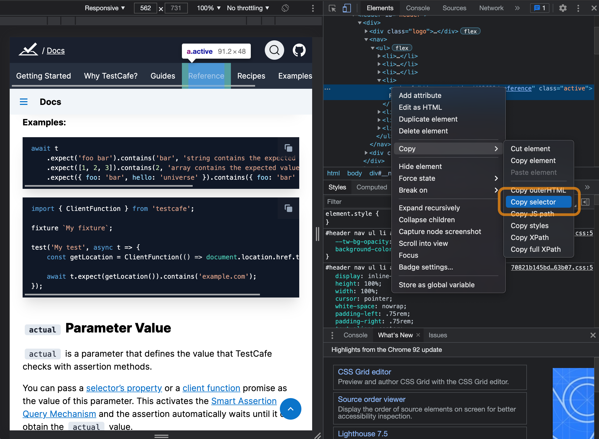
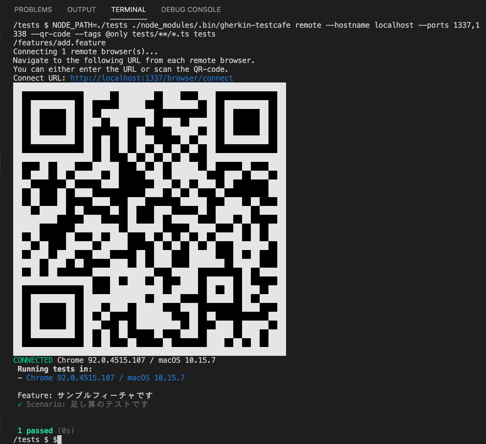

# gherkin-testcafe マニュアル

このマニュアルは gherkin-testcafe で E2E テストする場合のポイントをまとめたドキュメントです。

## 目次

1. [開発環境の準備](#prepare)
2. [プロジェクトの作成](#project)
3. [Gherkin 記法](#gherkin)
4. [TestCafe の使い方](#testcafe)
5. [Docker で使用](#docker)

<a id="prepare"></a>

## 開発環境の準備

_※パッケージマネージャとして yarn を使う前提で記述します。 npm を使う場合は適宜読み替えてください。_

### nodejs のインストール

こちらを参照して nodejs をインストールします。

[https://nodejs.org/ja/](https://nodejs.org/ja/)

### vscode の準備

こちらを参照して vscode をインストールします。

[https://code.visualstudio.com/](https://code.visualstudio.com/)

### vscode 用 Cucumber 機能拡張のインストール

「Cucumber (Gherkin) Full Support」をインストールします。

[https://marketplace.visualstudio.com/items?itemName=alexkrechik.cucumberautocomplete](https://marketplace.visualstudio.com/items?itemName=alexkrechik.cucumberautocomplete)

<a id="project"></a>

## プロジェクトの作成

適当な場所にディレクトリを作成し package.json を作成します。すでにプロジェクトがある場合はそのプロジェクトのディレクトリへ移動します。

```bash
$ mkdir work
$ cd work
$ yarn init -y
```

必要なモジュールをインストールします。

```bash
$ yarn add --dev @types/cucumber @types/node testcafe ts-node typescript @cucumber/cucumber gherkin-testcafe
```

tests ディレクトリを作成します。tests/common には共通部品を tests/features には feature を配置します。

```bash
$ mkdir -p tests/common
$ mkdir -p tests/features
```

typescript で開発する場合は ./tsconfig.json を作成します。baseUrl を tests にすることで共通部品の import の相対パスを省略できます。

```json
// tsconfig.json
{
  "compilerOptions": {
    "baseUrl": "tests"
  }
}
```

.vscode/settings.json を作成し Cucumber のオートコンプリートの設定をします。この設定をすることでステップ関数のオートコンプリートや定義へジャンプができるようになります。

```json
// .vscode/settings.json
{
  "cucumberautocomplete.steps": ["tests/**/*.ts"],
  "cucumberautocomplete.strictGherkinCompletion": true,
  "editor.quickSuggestions": true,
  "editor.quickSuggestionsDelay": 1000
}
```

TestCafe の設定ファイルを作成します。tsconfig.json へのパスを設定しています。

```json
// .testcaferc.json
{
  "compilerOptions": {
    "typescript": {
      "configPath": "tsconfig.json"
    }
  }
}
```

<a id="gherkin"></a>

## Gherkin 記法

Gherkin はシナリオが書かれたフィーチャファイルと、そのステップが実装されたファイルの組み合わせで定義します。

### 足し算テストシナリオ

次のコードブロックはフィーチャの例です。足し算をテストするシナリオです。tests/features/add.feature に下記のファイルを作成します。

```Gherkin
Feature: サンプルフィーチャです

  Scenario: 足し算のテストです
    Given 変数を初期化する
    When  変数に 1 を加える
    And   変数に 1 を加える
    Then  変数は 2 になる
```

Given、When、And、Then の行はステップと呼ばれています。このステップが上から順に実行されます。

次のコードブロックは足し算をテストするために必要なステップの実装コードです。tests/common/add.ts に下記のファイルを作成します。

```TypeScript
import { Selector } from "testcafe";
import { Given, When, Then } from "@cucumber/cucumber";

Given("変数を初期化する", async (t: TestController) => {
  t.ctx.variable = 0;
});

When("変数に {int} を加える", async (t: TestController, [value]) => {
  t.ctx.variable += value;
});

Then("変数は {int} になる", async (t: TestController, [value]) => {
  await t.expect(value).eql(t.ctx.variable);
});
```

各ステップ関数の引数 t はワールドオブジェクトです。gherkin-testcafe の場合のワールドオブジェクトは TestCafe のインスタンスになります。
t.ctx は実装者が自由に使って良いオブジェクトです。ここでは足し合わせた結果の variable プロパティを追加しています。

このシナリオを実行するには以下のコマンドを入力します。

```bash
$ NODE_PATH=./tests ./node_modules/.bin/gherkin-testcafe chrome tests/**/*.ts tests/features/add.feature
```

実行したい feature ファイルを指定します。下記のようにすると tests/features ディレクトリに入っているシナリオを全て実行します。

```bash
$ NODE_PATH=./tests ./node_modules/.bin/gherkin-testcafe chrome tests/**/*.ts tests/features/*.feature
```

環境変数 NODE_PATH は import の相対パスを省略するためのおまじないです。

実行すると次の様になります。

```bash
$ NODE_PATH=./tests ./node_modules/.bin/gherkin-testcafe chrome tests/**/*.ts tests/features/add.feature
 Running tests in:
 - Chrome 92.0.4515.131 / macOS 10.15.7

 Feature: サンプルフィーチャです
 ✓ Scenario: 足し算のテストです


 1 passed (0s)
$
```

### Cucumber 記法

「{int}」の部分はシナリオに定義された値が第２引数にパラメータとして渡されます。

```TypeScript
import { When } from "@cucumber/cucumber";

When("変数に {int} を加える", async (t: TestController, [value]) => {
  t.ctx.variable += value;
});
```

パラメータが複数ある場合は、配列の要素としてその数だけ渡されます。

```TypeScript
import { When } from "@cucumber/cucumber";

When("変数に {int} と {int} を加える", async (t: TestController, [value1, value2]) => {
  t.ctx.variable += value1 + value2;
});
```

パラメータタイプには以下のものがあります。

- {int} : 整数
- {float} : 実数
- {word} : スペースなしの文字列
- {string} : "..." で囲まれた文字列

Cucumber 記法について詳しくは下記ページを参照してください。

[https://cucumber.io/docs/cucumber/cucumber-expressions](https://cucumber.io/docs/cucumber/cucumber-expressions)

### シナリオのテンプレート利用

同じシナリオを条件を変えてテストしたい場合は Examples が使えます。tests/features/add2.feature に下記のファイルを作成します。

```Gherkin
Feature: サンプルフィーチャです

  Scenario: 足し算 <value1> + <value2> = <result> のテストです
    Given 変数を初期化する
    When  変数に <value1> を加える
    And   変数に <value2> を加える
    Then  変数は <result> になる

    Examples:
      | value1 | value2 | result |
      | 1      | 1      | 2      |
      | 2      | 3      | 5      |
```

Examples に書かれたテーブルの値が \<value1> \<value2> \<result> の値として代入され実行されます。この例では 2 つのシナリオが実行されます。

実行すると次の様になります。

```bash
$ NODE_PATH=./tests ./node_modules/.bin/gherkin-testcafe chrome tests/**/*.ts tests/features/add2.feature
 Running tests in:
 - Chrome 92.0.4515.131 / macOS 10.15.7

 Feature: サンプルフィーチャです
 ✓ Scenario: 足し算 1 + 1 = 2 のテストです
 ✓ Scenario: 足し算 2 + 3 = 5 のテストです


 2 passed (0s)
$
```

### ステップはグローバル関数

Gherkin のステップはグローバル関数です。ネームスペースやスコープがないため、同じ名前で異なる関数を作ることはできません。

同じ名前で異なる機能のステップ関数を作りたい場合は、実行時に依存するモジュールを指定して実行します。

```bash
$ NODE_PATH=./tests ./node_modules/.bin/gherkin-testcafe chrome tests/**/*.ts tests/features/add.feature
```

依存するモジュールはコマンド実行時に引数としてパスを渡します。上記例では、tests/\*_/_.ts が依存モジュールを示しています。

足し算シナリオだけで利用したいステップ関数がある場合は、ディレクトリ構成を変更して以下の様なコマンドを実行します。

```bash
$ NODE_PATH=./tests ./node_modules/.bin/gherkin-testcafe chrome tests/common/**/*.ts tests/feature/add/**/*.ts tests/features/add.feature
```

この例では足し算シナリオで使用するステップ関数は tests/feature/add に配置することを想定しています。

### ステップの実装は同じ

Gherkin 記法ではステップとして以下の記述を定義しています。_(...)は日本語の定義です。_

- Given (前提)
- When (もし)
- Then (ならば)
- And (かつ)
- But (しかし、但し、ただし)

これらのステップ関数は Cucumber.js の実装では defineStep 関数へのエイリアスで区別されません。ですから、以下の３つのステップ関数は同じ定義になります。

```JavaScript
import { Given, When, Then } from "@cucumber/cucumber";

Given("変数を初期化する", async (t: TestController) => {
  t.ctx.variable = 0;
});

Then("変数を初期化する", async (t: TestController) => {
  t.ctx.variable = 0;
});

When("変数を初期化する", async (t: TestController) => {
  t.ctx.variable = 0;
});
```

### シナリオの日本語化

Gherkin の実装 cucumber.js はローカライズ(多言語)に対応しています。

[https://cucumber.io/docs/gherkin/languages/](https://cucumber.io/docs/gherkin/languages/)

先頭行に 「# language: ja」を挿入すると足し算シナリオは次の様に記述できます。

```Gherkin
# language: ja
機能: サンプルフィーチャです

  シナリオ: 足し算のテストです
    前提   変数を初期化する
    もし   変数に 1 を加える
    かつ   変数に 1 を加える
    ならば 変数は 2 になる
```

このようにシナリオを日本語にすることもできますが、コード補完や定義へジャンプができないため、Given や Then などいくつかの英単語のみの利用ということもあり、日本語化せず英語のままでの利用がよいかもしれません。

### 連続するステップは「\*」を利用できる

以下のように同じステップが並ぶ時は、

```Gherkin
# language: ja
機能: サンプルフィーチャです

  シナリオ: 足し算のテストです
    前提   変数を初期化する
    もし   変数に 1 を加える
    かつ   変数に 1 を加える
    かつ   変数に 1 を加える
    かつ   変数に 1 を加える
    かつ   変数に 1 を加える
    ならば 変数は 5 になる
```

以下のように「\*」を使用して見やすくすることができます。

```Gherkin
# language: ja
機能: サンプルフィーチャです

  シナリオ: 足し算のテストです
    前提   変数を初期化する
    もし   変数に 1 を加える
    *     変数に 1 を加える
    *     変数に 1 を加える
    *     変数に 1 を加える
    *     変数に 1 を加える
    ならば 変数は 5 になる
```

連続するからと言って必ずしも「\*」を使う必要はなくどちらを使うかは好みです。

### コメント

「#」で始まる行はコメントになります。

```Gherkin
Feature: サンプルフィーチャです

  # コメント
  Scenario: 足し算のテストです
    Given 変数を初期化する
    When  変数に 1 を加える
    And   変数に 1 を加える
    Then  変数は 2 になる
```

### タグ

「@」で始まるキーワードはタグです。下記の例で「2 を加算するテストです」に「@only」タグがつけられています。

```Gherkin
Feature: サンプルフィーチャです

  Scenario: 1を加算するテストです
    Given 変数を初期化する
    When  変数に 1 を加える
    Then  変数は 1 になる

  @only
  Scenario: 2を加算するテストです
    Given 変数を初期化する
    When  変数に 2 を加える
    Then  変数は 2 になる
```

次のコマンドを実行することで「@only」タグが付いたシナリオだけ実行することができます。

```bash
$ NODE_PATH=./tests ./node_modules/.bin/gherkin-testcafe chrome --tags @only tests/common/**/*.ts tests/feature/add/**/*.ts tests/features/add.feature
```

タグを複数指定したり、特定のタグのシナリオだけ除外したりできます。詳しくは下記ページを参照してください。

[https://www.npmjs.com/package/gherkin-testcafe#tags](https://www.npmjs.com/package/gherkin-testcafe#tags)

<a id="testcafe"></a>

## TestCafe の使い方

TestCafe は E2E テストを行うためのフレームワークです。gherkin-testcafe を使用すると TestCafe を Gherkin 記法で利用できます。

### セレクタの調べ方

特定の要素を指定するためには CSS セレクタが必要になります。Chrome ブラウザの開発ツールを使用すると CSS セレクタを簡単に調べることができます。



1. 調べたいページを Chrome で開き、Control+Shift+i (mac は command+option+i) を押下して開発ツールを開きます。

2. インスペクターモードにして調べたい要素をクリックします。

3. エレメントペインに表示された要素を右クリックしてコンテキストメニューから「Copy -> Copy selector」を選択します。

4. セレクタを挿入したい箇所にペーストします。

### ページの移動

ページの移動は navigateTo メソッドを使います。

```TypeScript
import { Given } from "@cucumber/cucumber";

Given("{string} のページへ遷移", async (t: TestController, [url]) => {
  await t.navigateTo(url);
});
```

### エレメントの存在確認

```TypeScript
import { Then } from "@cucumber/cucumber";
import { Selector } from "testcafe";

Then("「タイトル」が存在する", async (t: TestController) => {
  const selector = Selector("h1.title").withText("タイトル");
  await t.expect(selector.exists).ok();
});
```

### エレメントをクリック

```TypeScript
import { When } from "@cucumber/cucumber";
import { Selector } from "testcafe";

When("「ボタン」をクリック", async (t: TestController) => {
  const selector = Selector("button").withText("ボタン");
  await t.click(selector);
});
```

### テキストエリアへの入力

```TypeScript
import { When } from "@cucumber/cucumber";
import { Selector } from "testcafe";

When("「文字列」を入力", async (t: TestController) => {
  const selector = Selector("input[type='text']");
  await t.click(selector).typeText(selector, "文字列");
});
```

### URL の取得

```TypeScript
import { ClientFunction } from "testcafe";

Then("URLが「example.com」を含む", async (t: TestController) => {
  const getLocation = ClientFunction(() => document.location.href.toString());
  await t.expect(getLocation()).contains('example.com');
});
```

<a id="docker"></a>

## Docker で使用

Docker を使ったテストは下記のように実行します。

初めに下記のコマンドで testcafe のコンテナを起動します。

```bash
$ docker run --add-host=localhost:127.0.0.1 -p 1337:1337 -p 1338:1338 -v ${PWD}:/tests -it --rm -w /tests --entrypoint "/bin/sh" testcafe/testcafe
```

コンテナ内のシェルに入ったら、下記コマンドでテストしたいフィーチャを指定します。

```bash
$ NODE_PATH=./tests ./node_modules/.bin/gherkin-testcafe remote --hostname localhost --ports 1337,1338 --qr-code tests/**/*.ts tests/features/add.feature
```

実行すると以下の様な画面になりますのでホスト PC のブラウザから http://localhost:1337/browser/connect に接続します。

localhost と指定した部分をホスト PC の IP アドレスにすることで、同じネットワーク内にいる他の PC やスマートフォンのブラウザを接続してテストすることもできます。



接続するとテストが実行され結果が表示されます。
